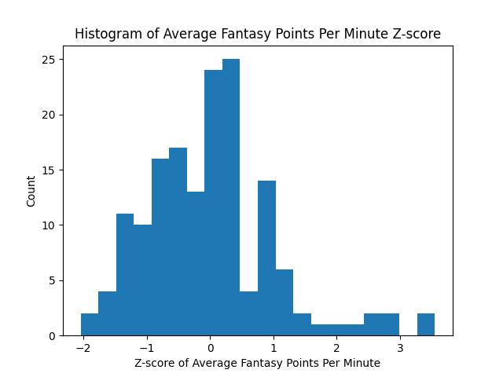
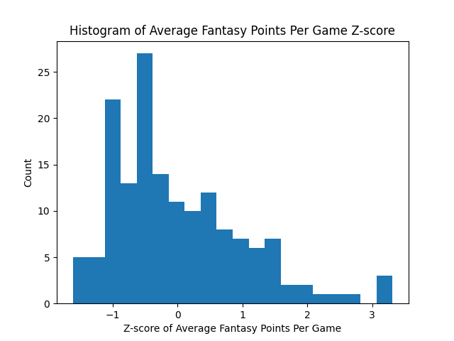

# Notes:

## Pre-season
- Walker Kessler starting over Collins
- Keyonte large role
- Randle to start "on merit"... questionable on role there. Naz up. 

## Non-fantasy related
- Donte Divincenzo -> elite roleplayer? 90th percentile VORP but by far lowest stat producer. 
- Vanvleet is also sick in terms of VORP
- Jarrett Allen? 90th percentile in both VORP and WS/48. 
- Jimmy elite in advanced stats... but box score stats not so much? 73rd in avg fantasy points per min. 

Players 90th quantile in VORP, WS/48, BPM:
- Embiid
- Jokic
- Luka
- Shai
- Giannis
- Haliburton
- AD
- Sabonis
- Kawhi
- Tatum
- Brunson
- Jimmy

## Fantasy related:
- Jimmy? seems fishy with low fpoints per minute (73rd) and lack of availability. 
- BPM/VORP most correlated to fantasy points of advanced stats.

Players who posted elite per minute fantasy numbers but have limited role (with permin rank and pergame rank):

- Day'ron Sharpe (39 227)
- Jonathan Isaac (35 212)
- Goga Bitadze (71 236)
- Trayce Jackson-Davis (32 194) 
- Jalen Smith (34 187)
- TJ Mcconnell (10 134)
- Paul Reed (76 164)
- Tari Eason (43 131)

Do any of these players have a path to a larger role this season? Would look into TJD & keep an eye on Sharpe. Otherwise not really. 

Same thing - but min 25 MPG and 35 GP (permin rank and pergame rank):

- Josh Giddey (52 107)
- Jusuf Nurkic (29 71)
- Isaiah Hartenstein (59 110)
- Clint Capela (36 85)
- Myles Turner (27 66)
- Collin Sexton (44 79)
- Khris Middleton (45 77)
- Kristaps Porzingis (12 36)
- Chet Holmgren (16 38)
- Evan Mobley (28 43)

Lots of bigs as they rack up rebounds and defensive stats in less play time. Once again this is role-dependent but I could see an increase for Chet and Mobley this year. Porzingis is appealing but the injury risk is ridiculous. Nurkic and Myles Turner could be good picks. Guards in these rankings could be very appealing given a bigger role (Sexton and Giddey). Most of these are upside swings. 

Opposite - players who rely on large workload (still min 25 MPG and 35 GP):
(permin rank pergame rank)
- Coby White (118 69)
- Miles Bridges (98 55)
- Mikal Bridges (113 72)
- Demar Derozan (71 30)
- Jerami Grant (119 85)
- OG Anunoby (133 100)
- Josh Hart (149 117)
- Julius Randle (72 41)
- Fred Vanvleet (48 22)
- Paolo Banchero (73 47)
- Nikola Vucevic (65 44)

DO NOT just look right at these and dismiss these players. Some of these more minute reliant players are safe as WILL continue to get a very large amount of playing time. Especially any player on the New York Knicks (which is about half this list). Guys I would be concerned about on this list are Miles Bridges, Mikal Bridges, Jerami Grant, and Nikola Vucevic. These players are either on developing teams with lots (and more important) mouths to feed, or have moved to a much better team with far less usage potential (Mikal). 

Notes on usage (high usage guys): 
- Lamelo -> third highest usage... if healthy could be elite.
- Donovan Mitchell 31% usage. Will this continue with new coach?
- Cam Thomas 30.5% usage. This if anything will go up this year. Just absolutely useless in every other category. 
- JJJ had 30% usage last year. Will cause significant decrease (LOOK INTO THIS). 
- Bane also had high usage - but he thrives as lower usage player as well so this may be okay. 
- Randle and Brunson both ~> 30% usage. Would avoid all other Knicks. (TRADE BROKE THIS). 

Low usage guys:
- Podz only 15% usage rate. Like this to increase this year with the loss of klay and his development (Kerr loves him)
- Lots of centers/role players. To be honest not much in terms of possible increases near the bottom. 

### Relation of Advanced Stats: 

- BPM is the most correlated - both from correlation exercise and feature importances of rf model. 
- VORP follows in second, then pretty steep dropoff
- Not sure how much this can actually help as these stats essentially model overall goodness of a player. 

#### BPM Vs Fantasy points per minute:
- Players with inflated BPM: mostly defensive guys. eg Jrue, Derrick White, Caruso
- Vice versa for deflated BPM: offensive reliant or stat merchants: Trae, Bobby Portis, Brandon Miller. 

#### Looking at default stats (PTS, AST, REB, BLK, STL, 3P, FG%, FT%, TO):
- Distributions of BLK/AST have longer/lower right tails - can get a leg up here. (eg. Wemby/Hali). 
- Largest correlations to fpoints come from scoring volume (PTS, FGA, FTA), and AST. 

For only top 25% of per minute fantasy producers. 

- Fantasy points per game still relies heavily on volume stats and assists.
- Also had a strong correlation with steals:
    - Steals seem to also be somewhat of a volume stat. 
    - Larger correlations between steals and pts/ast/fg etc. Scatter also shows this.
- Rebounds have limited correlation - seems to only be very positive when in extremely large volume. 
- Free throws also have a strong correlation - once again comes with volume scorers. 
- Blocks have a significantly lower correlation among the top 25% of FANTASY POINTS PER MINUTE than the entire player pool. 
    - Why? Because lots of the top fantasy producers per minute rely on blocks. So there are players like Wemby who thrive in 
        fantasy with high blocks, but there are also players like Bol Bol. 
- HOWEVER: this trend holds for the top 25% of FANTASY POINTS PER GAME. 
    - Similar reasoning to presented before. Players buoy their value enough with blocks to make them useful, but often lack in  the surrounding stats
Players with high steals are either high volume players or defensive specialists - which usually have limited fantasy value due to the low offensive ceilings. The high volume players usually provide value in may other categories as well. 
E.g. From the top 20 in steals/game:
- Fox 
- Shai 
- Dmitch 
- Caruso
- Thybulle
- Kawhi
- PG
- Luka
- Jokic
- Dyson Daniels
- Herb

TAKEAWAY: DO NOT draft a player because of steals besides maybe a few exceptions. They will come for players more involved anyways. Possible exceptions for this year could be: Dyson Daniels, Deanthony Melton. But this is also because they have a possibility of an expanded role and increase in other stats as well. 

Fantasy Points per game is very right-skewed. Picking the right top tier players is key. Points per minute not as much. 

OVERALL: Volume is king of course. However volume paired with another elite stat(s) (specfically AST/BLK) is what makes the best of the best. The best upside plays are players who fit this mold - however that often comes at a risk. Steals and rebounds are middling with value, as rebounds are valued minimally (1pt per) and steals are variable game to game and volume based. Be wary of overvaluing blocks on their own - this can lead to drafting one-dimensional bigs with no upside. 

    
  

